# 🐾 PawsConnect - Cloud-Native Pet Adoption Platform

A secure, resilient, and highly available two-tier web application for connecting adorable pets with loving adopters, built with modern cloud-native practices.

## 📋 Project Overview

PawsConnect is a production-grade pet adoption platform that demonstrates enterprise-level cloud architecture. The application allows users to browse available pets and submit adoption requests, all running on a secure AWS infrastructure with automated CI/CD deployment.

## 🏗️ Architecture

### Architecture Diagram

```mermaid
graph TB
    subgraph Internet
        User[👤 User]
    end
    
    subgraph "AWS Cloud"
        subgraph "VPC (10.0.0.0/16)"
            subgraph "Public Subnets"
                ALB[🔀 Application Load Balancer]
                IGW[🌐 Internet Gateway]
            end
            
            subgraph "Private Subnet 1"
                EC2[💻 EC2 Instance]
                Frontend[📱 Frontend Container]
                Backend[⚙️ Backend Container]
            end
            
            subgraph "Private DB Subnets"
                RDS[(🗄️ RDS PostgreSQL)]
            end
            
            NAT[🔄 NAT Gateway]
        end
    end
    
    User -->|HTTP| ALB
    ALB -->|Route /| Frontend
    ALB -->|Route /api/*| Backend
    Backend -->|SQL| RDS
    EC2 -->|Outbound| NAT
    NAT -->|Internet| IGW
```



### Key Components

- **VPC**: Custom Virtual Private Cloud (10.0.0.0/16) with complete network isolation
- **Subnets**: 
  - 2 Public subnets for the Application Load Balancer
  - 2 Private subnets for the application tier
  - 2 Private DB subnets for the database tier
- **Load Balancer**: Application Load Balancer distributing traffic to the application
- **Compute**: EC2 t2.micro instance running Docker containers in a private subnet
- **Database**: RDS PostgreSQL db.t3.micro in a dedicated private subnet
- **Security**: Multi-layered security groups controlling all network traffic

## 🚀 Live Application

**Access the deployed application here:** [http://your-load-balancer-url-here.amazonaws.com](http://your-load-balancer-url-here.amazonaws.com)

*Note: Replace with your actual Load Balancer URL after deployment*

## 🛠️ Technology Stack

### Frontend
- HTML5, CSS3, JavaScript
- Nginx web server
- Responsive design with CSS Grid

### Backend
- Node.js with Express.js
- PostgreSQL database integration
- RESTful API architecture

### Infrastructure
- **Cloud Provider**: AWS
- **IaC**: Terraform
- **Containerization**: Docker
- **CI/CD**: GitHub Actions
- **Security Scanning**: Trivy, tfsec

## 📦 Project Structure

```
pawsconnect-cloud-project/
├── frontend/
│   ├── index.html           # Main HTML file
│   ├── style.css            # Styles
│   ├── script.js            # Frontend logic
│   ├── nginx.conf           # Nginx configuration
│   ├── Dockerfile           # Frontend container definition
│   └── .dockerignore        # Files to exclude from image
├── backend/
│   ├── server.js            # Express API server
│   ├── package.json         # Node.js dependencies
│   ├── Dockerfile           # Backend container definition
│   └── .dockerignore        # Files to exclude from image
├── terraform/
│   ├── main.tf              # Main infrastructure code
│   ├── variables.tf         # Variable definitions
│   ├── outputs.tf           # Output values
│   ├── backend-setup.tf     # Remote state setup
│   ├── terraform.tfvars     # Variable values (DO NOT COMMIT)
│   └── .gitignore           # Terraform-specific gitignore
├── .github/
│   └── workflows/
│       └── deploy.yml       # CI/CD pipeline configuration
├── docker-compose.yml       # Local development setup
├── README.md                # This file
└── ARCHITECTURE.md          # Detailed architecture documentation
```

## 🏃 Running Locally with Docker Compose

### Prerequisites
- Docker Desktop installed
- Docker Compose installed

### Steps

1. **Clone the repository**
   ```bash
   git clone https://github.com/yourusername/pawsconnect-cloud-project.git
   cd pawsconnect-cloud-project
   ```

2. **Start all services**
   ```bash
   docker-compose up -d
   ```

3. **Access the application**
   - Frontend: http://localhost:8080
   - Backend API: http://localhost:5000/api/health

4. **View logs**
   ```bash
   docker-compose logs -f
   ```

5. **Stop all services**
   ```bash
   docker-compose down
   ```

## ☁️ Deploying to AWS

### Prerequisites

1. **AWS Account** with appropriate permissions
2. **AWS CLI** configured with credentials
3. **Terraform** installed (v1.5+)
4. **Docker Hub account**
5. **SSH key pair** generated (`~/.ssh/id_rsa.pub`)

### Deployment Steps

#### 1. Setup Remote State Backend

First, we need to create the S3 bucket and DynamoDB table for Terraform state:

```bash
cd terraform

# Comment out the backend block in main.tf temporarily
# Then run:
terraform init
terraform apply -target=aws_s3_bucket.terraform_state -target=aws_dynamodb_table.terraform_locks

# Now uncomment the backend block and re-initialize
terraform init -migrate-state
```

#### 2. Configure Variables

Edit `terraform/terraform.tfvars`:

```hcl
aws_region = "us-east-1"
project_name = "pawsconnect"
db_username = "dbadmin"
db_password = "YourSecurePassword123!"
docker_image_backend = "yourdockerhubusername/pawsconnect-backend:latest"
docker_image_frontend = "yourdockerhubusername/pawsconnect-frontend:latest"
my_ip = "YOUR.PUBLIC.IP.ADDRESS/32"
```

#### 3. Deploy Infrastructure

```bash
terraform plan
terraform apply
```

#### 4. Get Load Balancer URL

```bash
terraform output load_balancer_url
```

### Setting Up GitHub Actions

#### Required Secrets

Add these secrets to your GitHub repository (Settings → Secrets and variables → Actions):

- `AWS_ACCESS_KEY_ID`: Your AWS access key
- `AWS_SECRET_ACCESS_KEY`: Your AWS secret key
- `DOCKER_USERNAME`: Your Docker Hub username
- `DOCKER_PASSWORD`: Your Docker Hub password
- `DB_PASSWORD`: Your database password

#### Pipeline Workflow

1. **Push to any branch**: Runs tests and security scans
2. **Merge to main**: Deploys to production
   - Builds and scans Docker images
   - Pushes images to Docker Hub
   - Provisions/updates AWS infrastructure
   - Deploys new application version

## 🔒 Security Considerations

### Network Security

1. **VPC Isolation**: Custom VPC with no use of default VPC
2. **Subnet Segregation**: 
   - Public subnets only for Load Balancer
   - Private subnets for application (no direct internet access)
   - Dedicated DB subnets (completely isolated)
3. **Security Groups**:
   - ALB: Only accepts traffic on port 80 from internet
   - EC2: Only accepts traffic from ALB and SSH from specific IP
   - RDS: Only accepts PostgreSQL traffic from EC2 instances

### Application Security

1. **No Hard-Coded Secrets**: All sensitive data in environment variables
2. **Container Security**: 
   - Multi-stage Docker builds for smaller attack surface
   - Non-root users in containers
   - Regular vulnerability scanning with Trivy
3. **Infrastructure Security**:
   - IaC scanning with tfsec
   - Encrypted RDS storage
   - Encrypted S3 bucket for Terraform state
   - DynamoDB state locking prevents concurrent modifications

### Why Private Subnets?

- **Database**: Completely isolated from internet, accessible only by application
- **Application**: Cannot be directly accessed, all traffic goes through Load Balancer
- **Outbound Access**: NAT Gateway allows instances to download updates without exposing them

## 📊 Features

- ✅ Browse available pets with images and details
- ✅ Submit adoption requests with personal information
- ✅ Real-time statistics dashboard
- ✅ Responsive design (mobile-friendly)
- ✅ RESTful API with health checks
- ✅ PostgreSQL database with automatic initialization
- ✅ Error handling and user feedback

## 🧪 Testing

### Backend Tests
```bash
cd backend
npm install
npm test
```

### Security Scans
```bash
# Terraform security scan
tfsec terraform/

# Docker image scan
docker build -t pawsconnect-backend:test backend/
trivy image pawsconnect-backend:test
```

## 📝 API Endpoints

| Method | Endpoint | Description |
|--------|----------|-------------|
| GET | `/api/health` | Health check |
| GET | `/api/pets` | Get all pets |
| GET | `/api/pets/:id` | Get single pet |
| POST | `/api/adoptions` | Submit adoption request |
| GET | `/api/adoptions` | Get all adoption requests |

## 🤔 Reflection

### What inspired this project?

I wanted to create something cute and meaningful. Pet adoption is a meaningful cause, and building a platform that could help connect pets with families felt like the perfect way to apply cloud engineering skills to something that matters.

### What was the biggest challenge?

Setting up the networking architecture was tricky. Understanding the difference between public and private subnets, configuring route tables, and setting up the NAT Gateway took some time. I also had to learn how security groups work as "virtual firewalls" and ensure that each layer only accepts traffic from the appropriate source.

The CI/CD pipeline was also challenging - figuring out how to handle secrets securely and ensuring the pipeline only deploys on the main branch required careful configuration.

### What did I learn?

1. **Infrastructure as Code**: Writing infrastructure in code is so much better than clicking through consoles!
2. **Security by Design**: Every layer needs to be secured - from network isolation to container security
3. **Automation**: CI/CD pipelines save tons of time and reduce human error
4. **Docker**: Containerization makes applications portable and consistent across environments
5. **Cloud Networking**: VPCs, subnets, route tables, and security groups form the foundation of cloud security
6. **Terraform**: State management, variable usage, and resource dependencies are crucial for maintaining infrastructure

## 🙏 Acknowledgments

- AWAKE 7.0 Bootcamp for the opportunity and knowledge
- The cloud engineering community for excellent documentation
- All the adorable pets that inspired this project 🐕🐈

## 📜 License

This project is created for educational purposes as part of the AWAKE 7.0 Capstone Project.

---

**Made with ❤️ for pets everywhere | AWAKE 7.0 Class of 2025**